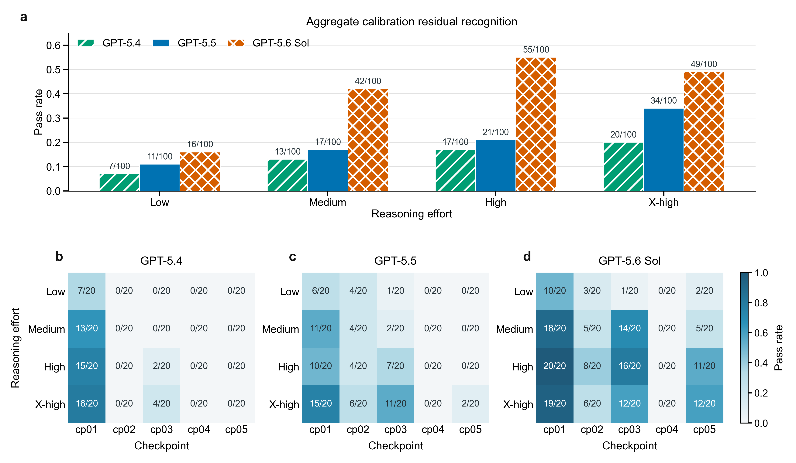
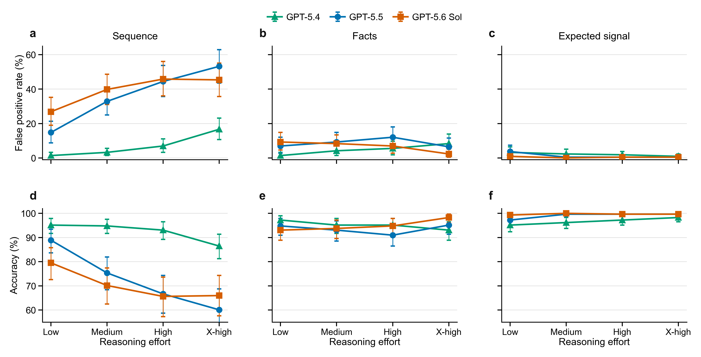

# NV Autonomous Experiments

## Overview

This repository is the public audit release accompanying a manuscript on an
LLM agent for autonomous nitrogen-vacancy center experiments.  The OpenClaw
platform provided the agent and project management layer around the NV
instrument control stack.

The manuscript has two connected contributions.  First, it demonstrates an
autonomous experimental workflow that combines persistent project records,
quantitative calculation and data analysis tools, and deterministic experiment
control.  Second, it evaluates scientific reasoning separately from laboratory
execution through Ramsey checkpoint and pODMR data evaluation benchmarks.

The release contains completed project records, evidence logs, bridge records,
figures, reports, benchmark inputs, labels, predictions, per run analysis notes,
manual scores, and analysis code needed to audit the reported results.  It is a
sanitized research release and not the full live OpenClaw backend.

## Paper and Repository Map

The order below follows the current manuscript.

| Manuscript component | What it shows | Repository entry point |
| --- | --- | --- |
| Figure 1. Autonomous NV workflow | The boundary between LLM reasoning, persistent project state, analysis tools, deterministic validation, and hardware control | [System overview](docs/system_overview.md), [runtime architecture](docs/runtime_architecture.md) |
| Figure 2. Main autonomous experiment | NV candidate selection, pODMR screening and calibration, Ramsey measurements, and a CPMG check of a weak feature that could be related to nearby carbon-13 coupling | [Main experiment `image172647`](cases/image172647/README.md) |
| Figure 3. Ramsey checkpoint benchmark | Recognition of a residual resonance calibration hypothesis across GPT-5.4, GPT-5.5, and GPT-5.6 Sol | [Three model Ramsey comparison](benchmarks/three-model-comparison-2026-07/ramsey/) |
| Figure 4. pODMR benchmark | Effects of prompt condition, reasoning effort, and model identity on resonance judgments | [Three model pODMR comparison](benchmarks/three-model-comparison-2026-07/podmr/) |
| Supplementary case studies and analyses | Two additional completed autonomous runs, representative pODMR inputs, deterministic checks, and detailed benchmark tables | [Additional cases](cases/README.md), [benchmark records](benchmarks/three-model-comparison-2026-07/README.md) |

## Public Scope

The case-referenced NV project management source is public for audit.  This
repository cannot control hardware.  Real completed case artifacts are
included, while live configuration, private queue locations, and runnable
hardware entry points are excluded.

See [docs/public_scope.md](docs/public_scope.md) for the exact public boundary.

## Autonomous Experiment Records

The main experiment in the manuscript is `image172647`.  The agent recovered
from a fresh image, screened candidate NV centers with pODMR, refined the
resonance calibration, acquired Ramsey measurements at multiple detunings, and
used a CPMG N=8 measurement to check a weak feature that could be related to a
nearby carbon-13 spin.  The released project folder records what the agent saw,
what it decided, the artifacts it wrote, and the evidence limits applied to the
final interpretation.

| Case | Role in the manuscript | Summary | Status |
| --- | --- | --- | --- |
| [`image172647`](cases/image172647/README.md) | Main autonomous workflow demonstration | Fresh image recovery, candidate rejection and acceptance, pODMR calibration, Ramsey measurements at multiple detunings, and a CPMG N=8 check | Completed |
| [`image145844`](cases/image145844/README.md) | Additional case study | Aligned NV selection, pODMR screening, repeated Ramsey diagnostics, and later frequency reanalysis | Completed |
| [`image231924`](cases/image231924/README.md) | Additional case study | Aligned NV selection, pODMR center refinement, Ramsey after resonance center correction, and a bounded `T2*` closeout | Completed |

## Offline Benchmarks

Both benchmarks were evaluated with GPT-5.4, GPT-5.5, and GPT-5.6 Sol using the
same inputs, prompts, reasoning effort settings, replicate structure, and
scoring rules for each model.  Model identifiers, execution dates, and direct
links to each model's records are collected in the
[parallel model index](benchmarks/three-model-comparison-2026-07/README.md).

| Benchmark | Design | Total size |
| --- | --- | ---: |
| [Ramsey checkpoint benchmark](benchmarks/three-model-comparison-2026-07/ramsey/) | Five chronological checkpoints, four reasoning effort settings, and twenty replicates per checkpoint and effort for each model | 1,200 runs |
| [pODMR data evaluation benchmark](benchmarks/three-model-comparison-2026-07/podmr/) | 96 measurements, three prompt conditions, four reasoning effort settings, and three replicates for each model | 10,368 decisions |

### Ramsey checkpoint benchmark

The Ramsey task tests whether the agent can integrate project records and a
newly returned Ramsey measurement to identify a missing hypothesis involving a
residual resonance calibration offset.  Later analysis, later measurements,
and human advice were excluded from each agent visible checkpoint package.

| Model | Low | Medium | High | X-high |
| --- | ---: | ---: | ---: | ---: |
| GPT-5.4 | 7/100 | 13/100 | 17/100 | 20/100 |
| GPT-5.5 | 11/100 | 17/100 | 21/100 | 34/100 |
| GPT-5.6 Sol | 16/100 | 42/100 | 55/100 | 49/100 |

Complete checkpoint values, per run records, and manual scoring evidence are
available from the [Ramsey comparison directory](benchmarks/three-model-comparison-2026-07/ramsey/).



### pODMR data evaluation benchmark

The pODMR task contains 24 resonance present and 72 resonance absent
measurements.  Each agent judged one unlabeled measurement at a time under
three prompt conditions.

| Condition | Information available to the agent |
| --- | --- |
| Sequence | Raw export, raw readout figure, and pulse sequence information |
| Facts | Sequence information plus compact experimental setup facts |
| Expected signal | Facts plus a requirement to calculate the expected signal before judging resonance presence |

Sequence information alone produced more false positive resonance judgments at
higher reasoning effort.  Requiring an expected signal calculation kept the
false positive rate between 0 and 3.70 percent across all three models and all
reasoning settings.  GPT-5.5 produced no false negatives.  GPT-5.6 Sol produced
one false negative in the low reasoning sequence condition.  GPT-5.4 produced
between two and eleven false negatives among 72 resonance present decisions in
each prompt and reasoning cell.

Complete point estimates, measurement level bootstrap intervals, predictions,
and analysis notes are available from the
[pODMR comparison directory](benchmarks/three-model-comparison-2026-07/podmr/).



Representative pODMR measurements used in the Supplementary Information are
available in the [original benchmark records](benchmarks/podmr-model-first-resonance-2026-05/README.md).

## Repository Layout

```text
cases/
  image145844/
  image172647/
  image231924/
benchmarks/
  three-model-comparison-2026-07/
    models/
      gpt-5.4/
      gpt-5.5/
      gpt-5.6-sol/
    figures/
    ramsey/
    podmr/
  nv-checkpoint-review-2026-06/
    inputs/
    labels/
    prompts/
    results/
  podmr-model-first-resonance-2026-05/
    inputs/
    labels/
    prompts/
    results/
python/
  openclaw_runtime/
  openclaw_nv_execution_source/
matlab/
  analysis/
  manifests/
  sequences/
tools/
docs/
```

## Documentation and Source Map

| Topic | Entry point |
| --- | --- |
| Public boundary | [docs/public_scope.md](docs/public_scope.md), [docs/source_release_boundary.md](docs/source_release_boundary.md) |
| System architecture | [docs/system_overview.md](docs/system_overview.md), [docs/runtime_architecture.md](docs/runtime_architecture.md) |
| Model and agent configuration | [docs/model_and_agent_configuration.md](docs/model_and_agent_configuration.md), [three model run conditions](benchmarks/three-model-comparison-2026-07/run_conditions.json) |
| Case guide | [docs/case_walkthrough.md](docs/case_walkthrough.md), [cases/README.md](cases/README.md) |
| Memory and knowledge | [docs/memory_knowledge.md](docs/memory_knowledge.md), [docs/nv_research_memory.md](docs/nv_research_memory.md), [docs/nv_research_knowledge_index.md](docs/nv_research_knowledge_index.md) |
| Project state and intents | [docs/project_state_template.md](docs/project_state_template.md), [docs/experiment_intent_schema.md](docs/experiment_intent_schema.md) |
| Code and safety | [docs/code_inventory.md](docs/code_inventory.md), [docs/safety_boundary.md](docs/safety_boundary.md) |
| Source provenance | [SOURCE_PROVENANCE.md](SOURCE_PROVENANCE.md) |

## Reproducibility

The released records support audit, offline analysis, and reconstruction of the
reported benchmark values and selected figures.  Full live laboratory
re-execution is outside the scope of this public release.

## License

Code is licensed under the MIT License.  Documentation, public case folders,
data exports, generated figures, reports, and analysis artifacts are licensed
under CC BY 4.0.  See [LICENSE](LICENSE).

## Citation

Citation metadata is provided in [CITATION.cff](CITATION.cff).
