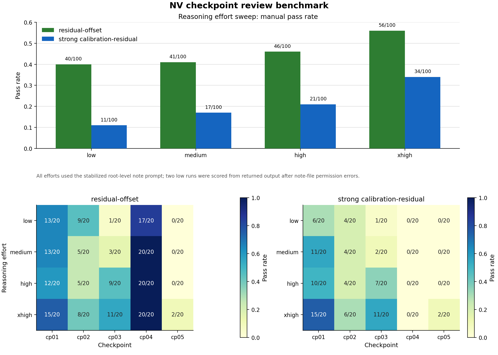
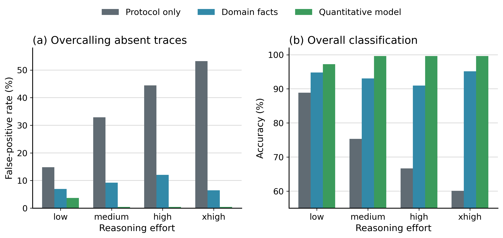

# NV Autonomous Experiments

## Overview

Public release for auditable LLM-agent workflows in NV-center experiments.
The completed workflows used the OpenClaw platform as the agent and
project-management layer around the NV instrument-control stack.

This repository has two parallel parts:

- **Case studies:** sanitized completed project folders from real
  autonomous-agent NV experiments.
- **Benchmarks:** offline Ramsey and pODMR tasks that evaluate how reasoning
  effort changes agent judgment on project records and recorded NV
  measurements.

The release preserves project state, evidence logs, bridge records, figures,
reports, analysis artifacts, benchmark inputs, labels, predictions, per-run
analysis notes, and scoring scripts needed to inspect the results. It is a
sanitized audit release, not the full live OpenClaw backend.

## Public Scope

The case-referenced NV project-management source is public for audit.

This repository cannot control hardware.

Real completed case artifacts are included.

See [docs/public_scope.md](docs/public_scope.md) for the exact public boundary.

## Start Here

For a quick review:

| Area | Entry point |
| --- | --- |
| System overview | [docs/system_overview.md](docs/system_overview.md) |
| Case studies | [cases/README.md](cases/README.md), [docs/case_walkthrough.md](docs/case_walkthrough.md) |
| Ramsey checkpoint benchmark | [benchmarks/nv-checkpoint-review-2026-06/README.md](benchmarks/nv-checkpoint-review-2026-06/README.md) |
| pODMR data evaluation benchmark | [benchmarks/podmr-model-first-resonance-2026-05/README.md](benchmarks/podmr-model-first-resonance-2026-05/README.md) |
| Model and agent configuration | [docs/model_and_agent_configuration.md](docs/model_and_agent_configuration.md) |
| Code inventory | [docs/code_inventory.md](docs/code_inventory.md) |
| Safety boundary | [docs/safety_boundary.md](docs/safety_boundary.md) |

## Repository Contents

| Part | What It Shows | Main Artifacts |
| --- | --- | --- |
| Case studies | A safety-bounded LLM research agent operating real NV-center experiments | Project state, evidence logs, bridge records, figures, reports, pODMR/Ramsey/CPMG analyses |
| Benchmarks | How reasoning effort affects hypothesis formation and pODMR data evaluation | Checkpoint packages, raw export JSON, raw-readout figures, prompts, labels, predictions, project notes, scoring scripts |
| Source and docs | Public audit boundary for NV project management and analysis | Python/MATLAB analysis code, public runtime source, system docs, safety notes |

## Case Studies

The case studies are completed autonomous NV project runs. They are intended to
show what the agent saw, what it decided, which artifacts it wrote, and how the
final scientific conclusions were bounded by the evidence.

| Case | Summary | Status |
| --- | --- | --- |
| [image145844](cases/image145844/README.md) | Aligned NV selection, pODMR screening, repeated Ramsey diagnostics, and later Ramsey frequency reanalysis | Completed |
| [image172647](cases/image172647/README.md) | Fresh re-image recovery, pODMR candidate rejection/acceptance, multi-detuning Ramsey, CPMG N=8 nearby-13C-like corroboration | Completed |
| [image231924](cases/image231924/README.md) | Aligned NV selection, pODMR center refinement, corrected-center Ramsey, T2star closeout | Completed |

## Benchmarks

The paper reports two offline benchmarks.  The Ramsey checkpoint benchmark tests
whether the agent can use project records and newly returned Ramsey data to
identify a missing residual calibration hypothesis.  The pODMR benchmark tests
whether the agent can judge resonance presence in previously acquired pODMR
measurements.

| Benchmark | Summary |
| --- | --- |
| [Ramsey checkpoint benchmark](benchmarks/nv-checkpoint-review-2026-06/README.md) | Five pre-analysis Ramsey checkpoints, four reasoning efforts, twenty replicates per checkpoint and effort, checkpoint packages, prompts, recovered project notes, and manual scoring CSVs |
| [pODMR data evaluation benchmark](benchmarks/podmr-model-first-resonance-2026-05/README.md) | 96 single-case pODMR classifications with prompts, raw inputs, labels, predictions, analysis notes, tool use audit, deterministic checks, and the batch comparison used in the appendix |

The Ramsey benchmark contains five chronological checkpoints named `cp01`
through `cp05`.  Each checkpoint includes the project state, memory and
knowledge snapshots, then available evidence, and terminal raw Ramsey data for
the newly completed measurement.  Later analysis notes, later measurements, and
human advice are excluded from the agent-visible checkpoint package.

The main reported Ramsey result is summarized in
[benchmarks/nv-checkpoint-review-2026-06/results/figures/reasoning_effort_sweep_low_to_xhigh_summary.csv](benchmarks/nv-checkpoint-review-2026-06/results/figures/reasoning_effort_sweep_low_to_xhigh_summary.csv).



The pODMR benchmark contains 24 resonance-present and 72 resonance-absent
strong-pi measurements. Each prompt condition was run for three replicates with
GPT-5.5 at four reasoning-effort settings: `low`, `medium`, `high`, and
`xhigh`.

The three prompt conditions are:

| Condition | Description |
| --- | --- |
| Sequence | Uses the raw export, raw-readout figure, and sequence XML. |
| Facts | Adds compact setup facts such as contrast scale, Rabi frequency scaling, and stored-average interpretation. |
| Expected signal | Adds a requirement to establish the expected signal with a simulation or explicit quantitative model calculation before judging resonance presence. |

The main trend is that higher reasoning effort alone can increase
false-positive resonance calls, while the calculation-guided condition suppresses
false positives across reasoning-effort settings without introducing false
negatives in this dataset. Full predictions, per-run analysis notes, and scoring
tables are included under
[benchmarks/podmr-model-first-resonance-2026-05/results](benchmarks/podmr-model-first-resonance-2026-05/results).
The appendix batch comparison is included as
[batch_context_main_inputs_summary.csv](benchmarks/podmr-model-first-resonance-2026-05/results/batch_context_main_inputs_summary.csv).



Example raw pODMR traces for one resonance-present case and one
resonance-absent case are shown below.  The figure plots the unnormalized
reference and signal readouts for each case.


| Reasoning | Protocol-only FPR | Domain-facts FPR | Calculation-guided FPR |
| --- | ---: | ---: | ---: |
| low | 14.81% | 6.94% | 3.70% |
| medium | 32.87% | 9.26% | 0.46% |
| high | 44.44% | 12.04% | 0.46% |
| xhigh | 53.24% | 6.48% | 0.46% |

## Repository Layout

```text
cases/
  image145844/
    project/
  image172647/
    project/
  image231924/
    project/
benchmarks/
  nv-checkpoint-review-2026-06/
    inputs/
    labels/
    prompts/
    results/
      figures/
      low_preanalysis_rootnote_2026-06-16/
      mhx_preanalysis_wake_2026-06-16/
  podmr-model-first-resonance-2026-05/
    inputs/
    labels/
    prompts/
    results/
      gpt-5.5-low/
      gpt-5.5-medium/
      gpt-5.5-high/
      gpt-5.5-xhigh/
python/
  openclaw_runtime/
  openclaw_nv_execution_source/
matlab/
  analysis/
  manifests/
  sequences/
tools/
requirements.txt
docs/
```

## Documentation Map

| Topic | Entry point |
| --- | --- |
| Public boundary | [docs/public_scope.md](docs/public_scope.md) |
| System architecture | [docs/system_overview.md](docs/system_overview.md), [docs/runtime_architecture.md](docs/runtime_architecture.md) |
| Model and agent configuration | [docs/model_and_agent_configuration.md](docs/model_and_agent_configuration.md), [docs/agent_prompt_context.md](docs/agent_prompt_context.md) |
| Case guide | [docs/case_walkthrough.md](docs/case_walkthrough.md), [cases/README.md](cases/README.md) |
| Memory and knowledge | [docs/memory_knowledge.md](docs/memory_knowledge.md), [docs/nv_research_memory.md](docs/nv_research_memory.md), [docs/nv_research_knowledge_index.md](docs/nv_research_knowledge_index.md), [docs/nv_research_knowledge_excerpt.md](docs/nv_research_knowledge_excerpt.md) |
| Agent prompt context | [docs/agent_prompt_context.md](docs/agent_prompt_context.md) |
| Project state and intents | [docs/project_state_template.md](docs/project_state_template.md), [docs/experiment_intent_schema.md](docs/experiment_intent_schema.md) |
| Code and safety | [docs/code_inventory.md](docs/code_inventory.md), [docs/source_release_boundary.md](docs/source_release_boundary.md), [docs/safety_boundary.md](docs/safety_boundary.md) |
| Source provenance | [SOURCE_PROVENANCE.md](SOURCE_PROVENANCE.md) |

## License

Code is licensed under the MIT License. Documentation, public case-study
folders, included data exports, generated figures, reports, and analysis
artifacts are licensed under CC BY 4.0. See `LICENSE`.

## Reproducibility

The included case artifacts are intended to support analysis review and
rebuilding of selected figures, metrics, and reports. Full live laboratory
re-execution is outside the scope of this public release.

## Citation

Citation metadata is provided in `CITATION.cff`.
